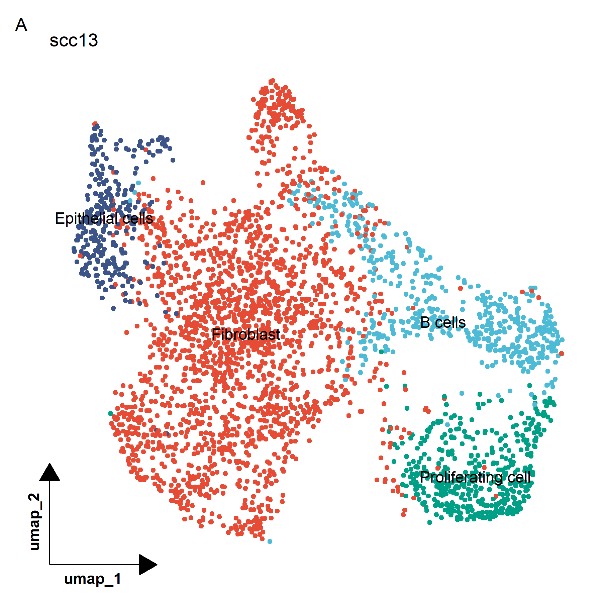

# 单细胞RNA分析(sc-RNA seq)

# 目录


单细胞测序技术，简单来说，是一种在单个细胞水平上对基因组、转录组及表观基因组进行测序分析的技术。与传统的测序方法相比，单细胞测序提供了对细胞异质性（即细胞之间的差异）的信息。
测序工作流程：
* 单细胞解离：通过一个称为单细胞解离的过程生成单细胞悬浮液，在这个过程中组织被消化。
* 单细胞分离：为了单独分析每个细胞中的mRNA，必须进行单细胞分离。基于平板的技术将细胞分离到平板的孔中，基于液滴的方法则依赖于在每个微流体液滴中捕获单个细胞。每个孔或液滴都包含必要的化学物质来分解细胞膜并进行文库构建。
* 文库构建：在这个过程中捕获细胞内的mRNA，将其逆转录为cDNA分子并放大。每个细胞的mRNA可以被标记为孔或液滴特有的细胞条形码。此外，许多实验协议还使用独特的分子标识符（UMI）来标记捕获的分子。在测序前对细胞cDNA进行放大，以增加其被测量的可能性。UMI使我们能够区分相同mRNA分子的放大副本和来自同一基因转录的不同mRNA分子的读取。
* 测序：文库构建后，细胞cDNA文库被标记为细胞条形码，根据协议，还可能加上UMI。这些文库被汇集在一起（多重）进行测序。测序产生读取数据，这些数据经过质量控制，根据分配的条形码进行分组（解复用）以及在读取处理流程中的比对。对于基于UMI的协议，读取数据可以进一步解复用，以产生捕获的mRNA分子的计数（计数数据）。
* 数据分析：对测序数据进行处理，包括质量控制、去除低质量数据、基因表达定量、数据标准化和细胞聚类分析等
目前单细胞测序获取细胞的方法主要有两种：

# 0 软件下载
* cellranger
```
mkdir -p biosoft
cd biosoft
curl -o cellranger-9.0.1.tar.gz "https://cf.10xgenomics.com/releases/cell-exp/cellranger-9.0.1.tar.gz?Expires=1739306000&Key-Pair-Id=APKAI7S6A5RYOXBWRPDA&Signature=J2do2WJYqchx29tS0FzkCC1wY1hvX2ucCOWcI-bH0MjTpve0UQZ54p1X6jF16jg5ojBPdiBI47zYFpFiJiJfFj07d8bbPZGXSi59G4fXzpw0ZDZMAV3Hoq0gHd7D8SFZLqo407W-K4VvEqTkVk7YNKuaHttRLftq3cW7E6ESw5VEzX5T6h33A7HLHiN1-1H9GlCVjZBCKqYfDctMc-f6B6Rm2E~Zyaq1azXoUKbGt8HZL-rJhC4gip1XZyCeX2mksC~fc95Na4CzdwwaOl9pNvJegynvSauyqdOWzUifVkwg7VZCTMjrWisPNY5c1UJ81w1ei-LCGIG3kFnyetTZLg__"

tar xvfz cellranger-9.0.1.tar.gz
cd cellranger-9.0.1/bin
export PATH="$(pwd):$PATH"
```
* R > 4.0
* R packages
```
#cran packages
cran_packages <- c("Seurat", "dplyr", "tibble", "ggplot2", "pheatmap", "ggsci", "ggrepel", "viridis", "devtools", "NMF", "tidyr", "clustree", "patchwork", "ggpubr")
install.packages(cran_packages)

#biocmanager packages
if (!requireNamespace("BiocManager", quietly = TRUE)) {
    install.packages("BiocManager")
}
bioc_packages <- c("monocle", "slingshot", "clusterProfiler", "org.Hs.eg.db", "GSVA", "GSEABase", "rtracklayer", "biomaRt", "harmony", "infercnv")
BiocManager::install(bioc_packages)

#others
devtools::install_github("cole-trapnell-lab/monocle3")  #monocle3
devtools::install_github('chris-mcginnis-ucsf/DoubletFinder') #DoubleFinder
devtools::install_github('immunogenomics/presto') #presto
```

# 1 上游数据获取与分析
## 1.1 实验数据下载
首先下载原始数据，为了进行演示，本文使用[Multimodal Analysis of Composition and Spatial Architecture in Human Squamous Cell Carcinoma](https://doi.org/10.1016/j.cell.2020.05.039)这篇文章的数据`GSE144240`，这里可以使用[anchr](https://github.com/wang-q/anchr)下载单细胞RNA测序中的一个样本数据缩短时间。（这里原始的测序数据ENA数据库缺失，可以使用NCBI下载）

```
#从NCBI上下载
nohup prefetch SRR11832836 SRR11832837 -O . &

parallel -j 2 "
  fastq-dump --split-files --gzip {1}
" ::: $(ls *.sra)

rm *.sra
```
## 1.2 数据分析
Cell Ranger是10X Genomics为单细胞分析专门打造的分析软件，直接对10X的下机数据进行基因组比对、定量、生成单细胞矩阵、聚类以及其他的分析等。
### 1.2.1 cellranger下载
[cellranger](https://www.10xgenomics.com/support/software/cell-ranger/downloads/eula?closeUrl=%2Fsupport%2Fsoftware%2Fcell-ranger&lastTouchOfferName=Cell%20Ranger&lastTouchOfferType=Software%20Download&product=chromium&redirectUrl=%2Fsupport%2Fsoftware%2Fcell-ranger%2Fdownloads)
```
#下载
curl -o cellranger-9.0.0.tar.gz "https://cf.10xgenomics.com/releases/cell-exp/cellranger-9.0.0.tar.gz?Expires=1732475246&Key-Pair-Id=APKAI7S6A5RYOXBWRPDA&Signature=n0TLqzGO8KBouaae8xNdDt9oFQpYvrNzv60L5tDWwI1bQnWMvsL-BZilGZNXM1uT34ZQGK6DoCScQzeHUgaTzHTWfbMqniyBfpXkmw3MURNN~jBAHLRkEy2A8p5IxZ-YruthvuxXxHJRDkgqk-uvNbdLxXYtCi~~FwEMw7GAaV3yW9j8xmx1GUHaGOrYCFIhwA6B5f~C6~K7DgVffu5C5CGn~BobQFmWalCp03Xy9LV~xDzRcIpVCasjQzyH4RYwLsPuhReNfNlmD86rnY1U894miOy3iCsPPoXmkaJi2bWqrRk04y7VsN0YRxe2jLX1X6Sy-USp7MQY~Z-veOgNNw__"

#安装
tar xvfz cellranger-9.0.0.tar.gz
cd ~/biosoft/cellranger-9.0.0
export PATH="$(pwd):$PATH"
source ~/.bashrc

cellranger
```
### 1.2.2 测序
下面介绍一下常用的Cell Ranger命令---cellranger count。count也是cellranger中一个很重要的命令，用来对单细胞转录组数据进行基因组比对，细胞定量最终得到用后下游分析的单细胞表达矩阵（默认情况也会对表达矩阵进行聚类）。<br>

在做定量之前，我们首先需要准备2组文件：原始fq文件以及物种的References（其中包括参考基因组序列、gtf文件以及star的索引文件）。<br>
* 1.原始fq文件<br>

cellranger的输入文件格式是fq格式，并且文件的命名也是有要求，文件命名格式如下：<br>
[Sample Name]_S1_L00[Lane Number]\_[Read Type]_001.fastq.gz<br>

详细可以看官网上的说明文档：[fastq-input](https://support.10xgenomics.com/single-cell-multiome-atac-gex/software/pipelines/latest/using/fastq-input#gex_rightname)<br>

如果fq的文件名格式不对，在运行的过程中会出现错误，所以最开始需要确定文件名的格式以及进行修改。
* 2.参考基因组<br>

好消息就是Cell Ranger官网已经为我们提供了人和小鼠的References，如果大家的样本是人或者小鼠的某些细胞可以直接去Cell Ranger官网进行下载。下载网页：[refdata](https://www.10xgenomics.com/support/software/cell-ranger/downloads#reference-downloads)
```
curl -O "curl -O "https://cf.10xgenomics.com/supp/cell-exp/refdata-gex-GRCh38-2024-A.tar.gz"
tar xvfz refdata-gex-GRCh38-2024-A.tar.gz
```
或者自建参考基因组:
大部分物种我们需要下载toplevel的序列文件(gtf.gz格式)，但是对于人和小鼠这类有单倍型信息的基因组，我们需要下载primary_assembly的序列。将下载好的文件传到linux主机上。<br>

10x单细胞使用的polydT进行RNA逆转录，只能测到带有polyA尾的RNA序列，所以我们需要从GTF文件中过滤掉non-polyA的基因。Cellranger的`mkgtf`命令可以对GTF文件进行过滤，通过--attribute参数指定需要保留的基因类型：<br>
```
cellranger mkgtf \
Homo_sapiens.GRC38.103.gtf \
Homo_sapiens.GRC38.103.filtered.gtf \
--attribute=gene_biotype:protein_coding \
--attribute=gene_biotype:lincRNA \
--attribute=gene_biotype:antisense \
--attribute=gene_biotype:IG_LV-gene \
--attribute=gene_biotype:IG_V_gene \
--attribute=gene_biotype:IG_V_pseudogene \
--attribute=gene_biotype:IG_D_gene \
--attribute=gene_biotype:IG_J_gene \
--attribute=gene_biotype:IG_C_gene \
--attribute=gene_biotype:IG_J_pseudogene \
--attribute=gene_biotype:IG_C_pseudogene \
--attribute=gene_biotype:TR_V_gene \
--attribute=gene_biotype:TR_V_pseudogene \
--attribute=gene_biotype:TR_D_gene \
--attribute=gene_biotype:TR_J_gene \
--attribute=gene_biotype:TR_C_gene \
--attribute=gene_biotype:TR_J_pseudogene \
```
Ensembl和NCBI提供的GTF文件通常都有gene_biotype标签来标记基因的类型。如果从其他来源下载的GTF文件中没有gene_biotype标记，那么就不需要对GTF进行过滤。<br>

处理完GTF文件之后，就可以使用cellranger的mkref命令构建基因组了：<br>
```
cellranger mkref --genome=Homo_sapiens.GRCh38.103 \
--fasta=Homo_sapiens.GRCh38.dna.primary_assembly.fa \
--genes=Homo_sapiens.GRCh38.103.filtered.gtf
```

* 3.定量<br>

构建好的基因组就可以进行下一步的定量。

```
cellranger count --id=scRNA \
  --create-bam false \
  --transcriptome=/home/zxy0303/project/scRNA/refdata \
  --fastqs=/home/zxy0303/project/scRNA/sequence/1 \
  --nosecondary \
  --sample=SRR11832842 \
  --jobmode=local
```
# 2 下游数据分析
# 2.1 数据下载
这里可以直接使用GSE144236中的单细胞测序表达矩阵数据
```
wget https://ftp.ncbi.nlm.nih.gov/geo/series/GSE144nnn/GSE144236/suppl/GSE144236%5FSCC13%5Fcounts.txt.gz
gzip -d GSE144236_SCC13_counts.txt.gz
mv GSE144236_SCC13_counts.txt scc13.txt
``` 
# 2.2 数据处理
使用R中的Seurat包
* 1.基于QC度量的细胞选择与筛选（即质控）
* 2.数据标化与缩放（即数据标准化）
* 3.高度可变特征的检测（特征性基因的选择）
## 2.2.1 质量控制
> ⼀般是指细胞的过滤，其实是从⼀个barcode X gene矩阵中过滤掉⼀部分不是细胞的barcode，如细胞碎⽚，双细胞，死细胞等。这三类barcode的特征可以通过其对应的基因表达情况来描述：`nCount(总基因表达数)、nFeature(总基因数)、percent.HB(红细胞基因表达⽐例)、percent.MT(线粒体基因表达⽐例)`。nCount和nFeature过⾼可能是双细胞，过低可能是细胞碎⽚。percent.HB刻画红细胞⽐例，percent.MT刻画细胞状态，值过⾼可能是濒临死亡的细胞

PercentageFeatureSet 函数是根据counts总数相除算的打分：该基因集的counts总和/所有基因的counts总和。
```
rm(list = ls())
if (!requireNamespace("Seurat", quietly = TRUE))
    install.packages("Seurat")
library(Seurat)

setwd("//wsl.localhost/Ubuntu/home/zxy0303/project/scRNA")

counts_matrix <- read.table("scc13.txt", header = TRUE, sep = "\t")
seurat_obj <- CreateSeuratObject(counts = counts_matrix)

seurat_obj[["percent.mito"]] <- PercentageFeatureSet(seurat_obj, pattern = "^hg19-MT-")

VlnPlot(seurat_obj, features = c("nFeature_RNA", "nCount_RNA", "percent.mito"), ncol = 3)

seurat_obj <- subset(seurat_obj, subset = nFeature_RNA > 200 & percent.mito < 10)

#如果有多个样本可以创建不同的seurat对象之后使用merge融合为一个seurat对象
#merged_seurat_obj <- merge(seurat_obj1, y = c(seurat_obj2), add.cell.ids = c("Sample1", "Sample2"))

LayerData(merged_seurat_obj, assay = "RNA", layer = "counts")
#但是仍然有2个layers。如果不进一步处理，后续在提取counts时数据不完整，分析会一直出错。因此我们需要使用JoinLayers函数对layers进行合并。
merged_seurat_obj <- JoinLayers(merged_seurat_obj)
#查看之后发现只有一个layer了
dim(merged_seurat_obj[["RNA"]]$counts)
```
## 2.2.2 标准化
标准化的意义：<br>
> 数据标准化的意义: 去除测序深度带来的影响<br>
> 标准化原则：每个细胞的每个基因的count数除以该细胞总count数，然后乘以因子（10000），再进行log(n+1)转换<br>

使用normalization函数，默认LogNormalize的方法
```
seurat_obj <- NormalizeData(seurat_obj)
```
## 2.2.3 找到高变基因
高变基因是指在单细胞RNA测序数据分析中，那些在不同细胞间表达差异显著的基因。可以使用FindVariableFeatures函数来获取。<br>
FindVariableFeatures（）参数意义：<br>
* FindVariableFeatures 函数有3种选择高表达变异基因的方法，可以通过 selection.method参数来选择，它们分别是： vst（默认值）， mean.var.plot 和 dispersion。 nfeatures 参数的默认值是 2000，可以改变。如果 selection.method 参数选择的是 mean.var.plot，就不需要人为规定高表达变异基因的数目，算法会自动选择合适的数目。 建议使用完 FindVariableFeatures 函数后，用 VariableFeaturePlot 对这些高表达变异基因再做个可视化，看看使用默认值 2000 会不会有问题。
```
#0.0125 <非零值均值 < 3 且标准差> 0.5
seurat_obj <- FindVariableFeatures(seurat_obj, selection.method = "vst", nfeatures = 2000, mean.cutoff = c(0.0125, 3), dispersion.cutoff = c(0.5, Inf))
```
# 3 PCA 分析：线性降维
主成分分析 (PCA, principal component analysis)是一种数学降维方法, 利用正交变换 (orthogonal transformation)把一系列可能`线性相关的变量`转换为一组`线性不相关的新变量`，也称为主成分，从而利用新变量在更小的维度下展示数据的特征。
## 3.1 标准化
在进行PCA之前，首先需要对数据进行标准化处理。这是因为不同特征的量纲和范围可能差异较大，直接进行分析可能导致某些特征对结果的影响过大。Seurat包中可以直接使用ScaleData()进行标准化：<br>

```
#回归 UMI 计数和线粒体基因百分比
seurat_obj <- ScaleData(seurat_obj, vars.to.regress = c("nCount_RNA", "percent.mito"))
```
## 3.2 PCA降维
```
#PCA降维：通常仅对高变基因进行标准化和降维
seurat_obj <- RunPCA(seurat_obj, features = VariableFeatures(object = seurat_obj))
```
## 3.3 确定合适的主成分数（使用 ElbowPlot 可视化）
> 目的：每个维度（pc）本质上代表一个“元特征”，它将相关特征集中的信息组合在一起。因此，越在顶部的主成分越可能代表数据集。然而，我们应该选择多少个主成分才认为我们选择的数据包含了绝大部分的原始数据信息呢？

方法<br>
* ElbowPlot函数，基于每个主成分所解释的方差百分比的排序，通过寻找“拐点”来判断几个维度可包含数据的大部分信息。

```
ElbowPlot(seurat_obj)
```


# 4 细胞类型注释
## 4.1 无监督聚类unsupervised clustering
将具有相似基因表达模式的细胞之间绘制边缘，然后将他们划分为一个内联群体。
```
#计算最邻近距离
seurat_obj <- FindNeighbors(seurat_obj, dims = 1:15)
#聚类，包含设置下游聚类的“间隔尺度”的分辨率参数resolution，增加值会导致更多的聚类。
seurat_obj <- FindClusters(seurat_obj, resolution = 0.15)
```
## 4.2 UMAP降维
* UMAP(Uniform Manifold Approximation and Projection)<br>
一种降维技术，假设可用数据样本均匀（Uniform）分布在拓扑空间（Manifold）中，可以从这些有限数据样本中近似（Approximation）并映射（Projection）到低维空间。<br>
以下描述不是官方定义，而是我总结出来的可帮助我们理解 UMAP 的要点。

  * Projection ——通过投影点在平面、曲面或线上再现空间对象的过程或技术。也可以将其视为对象从高维空间到低维空间的映射。<br>
  * Approximation——算法假设我们只有一组有限的数据样本（点），而不是构成流形的整个集合。因此，我们需要根据可用数据来近似流形。<br>
  * Manifold——流形是一个拓扑空间，在每个点附近局部类似于欧几里得空间。一维流形包括线和圆，但不包括类似数字8的形状。二维流形（又名曲面）包括平面、球体、环面等。关于流行的更多介绍可以查看：[流行](https://zhuanlan.zhihu.com/p/622263134)<br>
  * Uniform——均匀性假设告诉我们我们的数据样本均匀（均匀）分布在流形上。但是，在现实世界中，这种情况很少发生。因此这个假设引出了在流形上距离是变化的概念。即，空间本身是扭曲的：空间根据数据显得更稀疏或更密集的位置进行拉伸或收缩。<br>
基于选定的主成分（根据 ElbowPlot 确定为前 15 个主成分）进行 UMAP 降维并绘制 UMAP 图：
```
# 执行UMAP降维
seurat_obj <- RunUMAP(seurat_obj, dims = 1:15)

# 绘制UMAP图（可根据需要调整参数，如label是否显示标签等）
DimPlot(seurat_obj, reduction = "umap", label = TRUE)
```

## 4.3 差异表达分析
使用 FindAllMarkers 函数进行差异表达分析，获取每个聚类的标记基因（默认参数）：
```
cluster_markers <- FindAllMarkers(seurat_obj, only.pos = TRUE)
```
FindAllMarkers（）参数意义：<br>
* only.pos = TRUE：只寻找上调的基因
* min.pct = 0.1：某基因在细胞中表达的细胞数占相应cluster细胞数最低10%
* logfc.threshold = 0.25 ：fold change倍数为0.25 
## 4.4 细胞类型注释
关于细胞注释可以查看这篇文章[https://www.sohu.com/a/474334410_121118947](细胞注释)<br>
这里使用CellMarker中的[cell annotation](https://bibio-bigdata.hrbmu.edu.cn/CellMarker/CellMarker_annotation.jsp)工具进行人工注释：
```
#对marker_gene进行筛选p_val<0.05
cluster_markers %>% subset(p_val<0.05)
#所有基因先分组，再根据avg_log2FC进行排序，选出每组前十个
list_marker <- cluster_markers %>% group_by(cluster) %>% top_n(n = 10, wt = avg_log2FC)
#保存差异分析结果到csv
df_marker=data.frame(p_val = list_marker$p_val,
                     avg_log2FC = list_marker$avg_log2FC,
                     pct.1 = list_marker$pct.1,
                     pct.2 = list_marker$pct.2,
                     p_val_adj = list_marker$p_val_adj,
                     cluster = list_marker$cluster,
                     gene = list_marker$gene)
write.csv(df_marker,"marker.csv")
 
#添加细胞注释信息,通过CellMarker注释每一个cluster代表的细胞类群
new.cluster.ids <- c("Fibroblast", "B cells", "Proliferating cell", "Epithelial cells")
names(new.cluster.ids) <- levels(seurat_obj)
seurat_obj <- RenameIdents(seurat_obj, new.cluster.ids)
DimPlot(seurat_obj, reduction = "umap", label = TRUE, pt.size = 0.5) + NoLegend()
```
<br>
umap图美化：
```
#可以将坐标轴进行缩放
##调用第三方包
library(tidyr)
library(ggplot2)
##绘图
p <- DimPlot(seurat_obj, reduction = "umap", label = TRUE, pt.size = 1.2 ,label.size = 5) + 
  theme_dr(xlength = 0.2, 
           ylength = 0.2,
           arrow = arrow(length = unit(0.2, "inches"),type = "closed")) +
  theme(panel.grid = element_blank(),
        axis.title = element_text(face = 2,hjust = 0.03)) +
  NoLegend()
```
几个参数
* pt.size = 1.2：设置绘制的点（代表细胞）的大小为 1.2，调整点的大小可以影响图形的清晰度和视觉效果，使细胞分布更加直观可见。<br>
* theme_dr主题函数调整图片主题样式<br>
  * face是加粗<br>
  * hjust = 0.03设置水平对齐方式，使坐标轴标题向左偏移一定距离，以避免与图形内容重叠或改善视觉布局。<br>
生成的图片如下：<br>
<br>
还可以将配色进行调整：
```
##调用第三方包
library(ggsci)
##随机选一种
p1 <- p + scale_color_npg() + labs(title = "scc13", tag = "A")
ggsave("umap4.png", plot = p1, width = 6, height = 6, dpi = 300)
```

# 5 细胞子集：
## 5.1 提取髓细胞相关聚类
seurat_obj--cell_type-`Myeloid`
```
myeloid_cells <- subset(seurat_obj, subset = cell_type == "Myeloid")
```
## 5.2 重新进行降维分析
```
myeloid_cells <- RunPCA(myeloid_cells)
```
## 5.3 高分辨率聚类
`FindClusters`
```
myeloid_cells <- FindClusters(myeloid_cells, resolution = 0.6)
```
## 5.4 差异表达分析
`FindAllMarkers`
```
myeloid_cluster_markers <- FindAllMarkers(myeloid_cells)
```
## 5.5 确定细胞子集
同细胞类型注释。。。
# 6 细胞周期分析
细胞周期一般分成4个阶段:

* G1(gap1)：Cell increases in size(Cellular contents duplicated)
* S(synthesis) ：DNA replication, each of the 46 chromosomes (23 pairs) is replicated by the cell
* G2(gap2)：Cell grows more，organelles and proteins develop in preparation for cell division，为分裂做准备
* M(mitosis)：'Old' cell partitions the two copies of the genetic material into the two daughter cells.
And the cell cycle can begin again.<br>

在分析单细胞数据时，同一类型的细胞往往来自于不同的细胞周期阶段，这可能对下游聚类分析，细胞类型注释产生混淆；<br>

由于细胞周期也是通过cell cycle related protein 调控，即每个阶段有显著的marker基因；通过分析细胞周期有关基因的表达情况，可以对细胞所处周期阶段进行注释；<br>

在单细胞周期分析时，通常只考虑三个阶段：`G1、S、G2M`。(即把G2和M当做一个phase)

## 6.1 确定细胞周期相关基因和循环细胞
首先需要确定用于细胞周期评分的基因，通常 Seurat 包提供了人类细胞周期基因的列表（分为 S 期和 G2/M 期基因），可以使用以下方式获取：
```
str(cc.genes)
#List of 2
# $ s.genes  : chr [1:43] "MCM5" "PCNA" "TYMS" "FEN1" ...
# $ g2m.genes: chr [1:54] "HMGB2" "CDK1" "NUSAP1" "UBE2C" ...
```
如上是Seurat包提供的人的细胞中分别与S期、G2M期直接相关的marker基因。<br>

`CellCycleScoring`函数即根据此，对每个细胞的S期、G2M期可能性进行打分；具体如何计算的，暂时在Seurat官方文档中没有提及。
```
# 加载Seurat内置的细胞周期基因列表
s.genes <- cc.genes$s.genes
g2m.genes <- cc.genes$g2m.genes


# 使用CellCycleScoring函数计算S期和G2/M期得分
seurat_obj <- CellCycleScoring(seurat_obj, 
                               s.features = s.genes, 
                               g2m.features = g2m.genes, 
                               set.ident = FALSE)

# 使用ScaleData函数回归S期和G2/M期得分
seurat_obj <- ScaleData(seurat_obj, 
                        verbose = FALSE, 
                        features = NULL, 
                        variables = c("S.Score", "G2M.Score"))

# 重新聚类
seurat_obj <- FindNeighbors(seurat_obj, dims = 1:10)
seurat_obj <- FindClusters(seurat_obj, resolution = 0.5)  # 这里的分辨率需要根据数据调整
```
## 6.3 计算循环细胞的比例
```
# 例如，可以设置一个阈值来确定哪些细胞是循环的
threshold <- 0.5  # 这个阈值需要根据您的数据来调整
seurat_obj@meta.data$is.cycling <- seurat_obj@meta.data$S.Score > threshold

# 计算每个聚类中的循环细胞数量
pre_regression_clusters <- table(seurat_obj@meta.data$seurat_clusters[seurat_obj@meta.data$is.cycling])
post_regression_clusters <- table(Idents(seurat_obj)[seurat_obj@meta.data$is.cycling])

# 计算循环细胞的比例
proportion_cycling_cells <- sum(post_regression_clusters) / sum(pre_regression_clusters)

# 输出循环细胞的比例
proportion_cycling_cells
```
