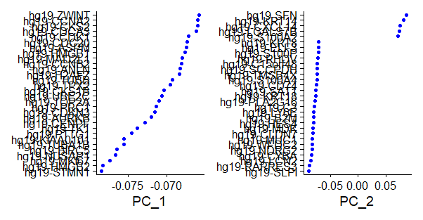

# 单细胞RNA分析(sc-RNA seq)
[单细胞测序流程](./pic/单细胞测序流程.png "单细胞测序流程")
# 目录

# 0 介绍
单细胞测序技术，简单来说，是一种在单个细胞水平上对基因组、转录组及表观基因组进行测序分析的技术。与传统的测序方法相比，单细胞测序提供了对细胞异质性（即细胞之间的差异）的信息。
测序工作流程：
* 单细胞解离：通过一个称为单细胞解离的过程生成单细胞悬浮液，在这个过程中组织被消化。
* 单细胞分离：为了单独分析每个细胞中的mRNA，必须进行单细胞分离。基于平板的技术将细胞分离到平板的孔中，基于液滴的方法则依赖于在每个微流体液滴中捕获单个细胞。每个孔或液滴都包含必要的化学物质来分解细胞膜并进行文库构建。
* 文库构建：在这个过程中捕获细胞内的mRNA，将其逆转录为cDNA分子并放大。每个细胞的mRNA可以被标记为孔或液滴特有的细胞条形码。此外，许多实验协议还使用独特的分子标识符（UMI）来标记捕获的分子。在测序前对细胞cDNA进行放大，以增加其被测量的可能性。UMI使我们能够区分相同mRNA分子的放大副本和来自同一基因转录的不同mRNA分子的读取。
* 测序：文库构建后，细胞cDNA文库被标记为细胞条形码，根据协议，还可能加上UMI。这些文库被汇集在一起（多重）进行测序。测序产生读取数据，这些数据经过质量控制，根据分配的条形码进行分组（解复用）以及在读取处理流程中的比对。对于基于UMI的协议，读取数据可以进一步解复用，以产生捕获的mRNA分子的计数（计数数据）。
* 数据分析：对测序数据进行处理，包括质量控制、去除低质量数据、基因表达定量、数据标准化和细胞聚类分析等
目前单细胞测序获取细胞的方法主要有两种：

## 0.1 实验数据下载
首先下载原始数据，为了进行演示，本文使用[Multimodal Analysis of Composition and Spatial Architecture in Human Squamous Cell Carcinoma](https://doi.org/10.1016/j.cell.2020.05.039)这篇文章的数据`GSE144240`，这里可以使用[anchr](https://github.com/wang-q/anchr)下载单细胞RNA测序中的一个样本数据缩短时间。
GSE144240-GSE144236

```
mkdir -p ~/project/genome
cd ~/project/genome

cat <<EOF > source.csv
SRX8383286,,HiSeq 4000
EOF

anchr ena info | perl - -v source.csv > ena_info.yml
anchr ena prep | perl - ena_info.yml

mlr --icsv --omd cat ena_info.csv

aria2c -j 4 -x 4 -s 2 -c --file-allocation=none -i ena_info.ftp.txt

md5sum --check ena_info.md5.txt

# sampling reads as test materials
seqtk sample -s 23 SRR5042715_1.fastq.gz 20000 | pigz > R1.fq.gz
seqtk sample -s 23 SRR5042715_2.fastq.gz 20000 | pigz > R2.fq.gz


nohup prefetch SRR11832836 SRR11832837 -O . &

parallel -j 2 "
  fastq-dump --split-files --gzip {1}
" ::: $(ls *.sra)

rm *.sra
```
## 0.2 数据分析
cellranger
### 0.2.1 cellranger下载
[cellranger](https://www.10xgenomics.com/support/software/cell-ranger/downloads/eula?closeUrl=%2Fsupport%2Fsoftware%2Fcell-ranger&lastTouchOfferName=Cell%20Ranger&lastTouchOfferType=Software%20Download&product=chromium&redirectUrl=%2Fsupport%2Fsoftware%2Fcell-ranger%2Fdownloads)
```
#下载
curl -o cellranger-9.0.0.tar.gz "https://cf.10xgenomics.com/releases/cell-exp/cellranger-9.0.0.tar.gz?Expires=1732475246&Key-Pair-Id=APKAI7S6A5RYOXBWRPDA&Signature=n0TLqzGO8KBouaae8xNdDt9oFQpYvrNzv60L5tDWwI1bQnWMvsL-BZilGZNXM1uT34ZQGK6DoCScQzeHUgaTzHTWfbMqniyBfpXkmw3MURNN~jBAHLRkEy2A8p5IxZ-YruthvuxXxHJRDkgqk-uvNbdLxXYtCi~~FwEMw7GAaV3yW9j8xmx1GUHaGOrYCFIhwA6B5f~C6~K7DgVffu5C5CGn~BobQFmWalCp03Xy9LV~xDzRcIpVCasjQzyH4RYwLsPuhReNfNlmD86rnY1U894miOy3iCsPPoXmkaJi2bWqrRk04y7VsN0YRxe2jLX1X6Sy-USp7MQY~Z-veOgNNw__"

#安装
tar xvfz cellranger-9.0.0.tar.gz
cd ~/biosoft/cellranger-9.0.0
export PATH="$(pwd):$PATH"
source ~/.bashrc

cellranger
```
### 0.2.2 参考基因组下载
https://www.10xgenomics.com/support/software/space-ranger/downloads#reference-downloads
```
curl -O "https://cf.10xgenomics.com/supp/spatial-exp/refdata-gex-GRCh38-2020-A.tar.gz"
tar xvfz refdata-gex-GRCh38-2020-A.tar.gz
```
* 或者自建参考基因组<br>
refgenome:
> 大部分物种我们需要下载toplevel的序列文件，但是对于人和小鼠这类有单倍型信息的基因组，我们需要下载primary_assembly的序列。将下载好的文件传到linux主机上。<br>

annotation:gtf.gz<br>
> 10x单细胞使用的polydT进行RNA逆转录，只能测到带有polyA尾的RNA序列，所以我们需要从GTF文件中过滤掉non-polyA的基因。Cellranger的`mkgtf`命令可以对GTF文件进行过滤，通过--attribute参数指定需要保留的基因类型<br>

处理完GTF文件之后，就可以使用cellranger的`mkref`命令构建基因组了

### 0.2.3 测序
```
cellranger count --id=scRNA \
  --create-bam false \
  --transcriptome=/home/zxy0303/project/scRNA/refdata \
  --fastqs=/home/zxy0303/project/scRNA/sequence/1 \
  --nosecondary \
  --sample=SRR11832842 \
  --jobmode=local
```

# 1 数据下载
GSE144240-GSE144236
```
wget https://ftp.ncbi.nlm.nih.gov/geo/series/GSE144nnn/GSE144236/suppl/GSE144236%5FSCC13%5Fcounts.txt.gz
gzip -d GSE144236_SCC13_counts.txt.gz
mv GSE144236_SCC13_counts.txt scc13.gz
``` 
# 2 数据处理
R-Seurat 
* 1.基于QC度量的细胞选择与筛选（即质控）
* 2.数据标化与缩放（即数据标准化）
* 3.高度可变特征的检测（特征性基因的选择）
## 2.1 质量控制
> ⼀般是指细胞的过滤，其实是从⼀个barcode X gene矩阵中过滤掉⼀部分不是细胞的barcode，如细胞碎⽚，双细胞，死细胞等。这三类barcode的特征可以通过其对应的基因表达情况来描述：`nCount(总基因表达数)、nFeature(总基因数)、percent.HB(红细胞基因表达⽐例)、percent.MT(线粒体基因表达⽐例)`。nCount和nFeature过⾼可能是双细胞，过低可能是细胞碎⽚。percent.HB刻画红细胞⽐例，percent.MT刻画细胞状态，值过⾼可能是濒临死亡的细胞

PercentageFeatureSet 函数是根据counts总数相除算的打分：该基因集的counts总和/所有基因的counts总和。
```
rm(list = ls())
if (!requireNamespace("Seurat", quietly = TRUE))
    install.packages("Seurat")
library(Seurat)

setwd("//wsl.localhost/Ubuntu/home/zxy0303/project/scRNA")

counts_matrix <- read.table("scc13.txt", header = TRUE, sep = "\t")
seurat_obj <- CreateSeuratObject(counts = counts_matrix)

seurat_obj[["percent.mito"]] <- PercentageFeatureSet(seurat_obj, pattern = "^hg19-MT-")

VlnPlot(seurat_obj, features = c("nFeature_RNA", "nCount_RNA", "percent.mito"), ncol = 3)

seurat_obj <- subset(seurat_obj, subset = nFeature_RNA > 200 & percent.mito < 10)

#merge different samples
#merged_seurat_obj <- merge(seurat_obj1, y = c(seurat_obj2), add.cell.ids = c("Sample1", "Sample2"))
```
## 2.2 标准化
标准化的意义：<br>
> 数据标准化的意义: 去除测序深度带来的影响<br>
> 标准化原则：每个细胞的每个基因的count数除以该细胞总count数，然后乘以因子（10000），再进行log(n+1)转换<br>

使用normalization函数，默认LogNormalize的方法
```
seurat_obj <- NormalizeData(seurat_obj)
```
## 2.3 找到高变基因
FindVariableFeatures（）参数意义：<br>
* FindVariableFeatures 函数有 3 种选择高表达变异基因的方法，可以通过 selection.method参数来选择，它们分别是： vst（默认值）， mean.var.plot 和 dispersion。 nfeatures 参数的默认值是 2000，可以改变。如果 selection.method 参数选择的是 mean.var.plot，就不需要人为规定高表达变异基因的数目，算法会自动选择合适的数目。 建议使用完 FindVariableFeatures 函数后，用 VariableFeaturePlot 对这些高表达变异基因再做个可视化，看看使用默认值 2000 会不会有问题。
```
#0.0125 <非零值均值 < 3 且标准差> 0.5
seurat_obj <- FindVariableFeatures(seurat_obj, selection.method = "vst", nfeatures = 2000, mean.cutoff = c(0.0125, 3), dispersion.cutoff = c(0.5, Inf))
```
# 3 PCA 分析：线性降维
## 3.1 标准化
ScaleData()标准化函数作用：<br>
> 为后续PCA降维做准备。<br>
> PCA降维要求数据为正态分布，即平均值为0，方差为1。<br>
```
#回归 UMI 计数和线粒体基因百分比
seurat_obj <- ScaleData(seurat_obj, vars.to.regress = c("nCount_RNA", "percent.mito"))
```
## 3.2 PCA降维
```
#PCA降维：通常仅对高变基因进行标准化和降维
seurat_obj <- RunPCA(seurat_obj, features = VariableFeatures(object = seurat_obj))

#选择前5个维度进行查看
print(seurat_obj[["pca"]], dims = 1:5, nfeatures = 5)

#PCA降维后的细胞嵌入的前两行和前两列的数据
head(seurat_obj[['pca']]@cell.embeddings)[1:2,1:2]
#                     PC_1      PC_2
#AAACCTGAGCCACGCT 7.965446 -3.265728
#AAACCTGGTAGCCTCG 7.356585 -6.612420

#可视化
DimPlot(seurat_obj, reduction = "pca")

VizDimLoadings(seurat_obj, dims = 1:2, reduction = "pca")
```
DimPlot（）函数生成主成分分析结果图：<br>
<br>
VizDimLoadings结果图：<br>


## 3.3 确定合适的主成分数（使用 ElbowPlot 可视化）
> 目的：每个维度（pc）本质上代表一个“元特征”，它将相关特征集中的信息组合在一起。因此，越在顶部的主成分越可能代表数据集。然而，我们应该选择多少个主成分才认为我们选择的数据包含了绝大部分的原始数据信息呢？

方法<br>
* ElbowPlot函数，基于每个主成分所解释的方差百分比的排序，通过寻找“拐点”来判断几个维度可包含数据的大部分信息。

```
ElbowPlot(seurat_obj)
```


## 3.4 UMAP降维聚类
基于选定的主成分（根据 ElbowPlot 确定为前 15 个主成分）进行 UMAP 降维并绘制 UMAP 图：
```
# 执行UMAP降维
seurat_obj <- RunUMAP(seurat_obj, dims = 1:15)

# 绘制UMAP图（可根据需要调整参数，如label是否显示标签等）
DimPlot(seurat_obj, reduction = "umap", label = TRUE)
```

# 4 细胞类型注释
## 4.1 无监督聚类unsupervised clustering
```
#计算最邻近距离
seurat_obj <- FindNeighbors(seurat_obj, dims = 1:15)
#聚类，包含设置下游聚类的“间隔尺度”的分辨率参数resolution ，增加值会导致更多的聚类。
seurat_obj <- FindClusters(seurat_obj, resolution = 0.1)

head(Idents(seurat_obj), 5)
```
## 4.2 差异表达分析
使用 FindAllMarkers 函数进行差异表达分析，获取每个聚类的标记基因（默认参数）：
```
cluster_markers <- FindAllMarkers(seurat_obj, only.pos = TRUE)
```
FindAllMarkers（）参数意义：<br>
* only.pos = TRUE：只寻找上调的基因
* min.pct = 0.1：某基因在细胞中表达的细胞数占相应cluster细胞数最低10%
* logfc.threshold = 0.25 ：fold change倍数为0.25

所有基因先分组，再根据avg_log2FC进行排序:
```
cluster_markers %>% group_by(cluster) %>% top_n(n = 2, wt = avg_log2FC)
# A tibble: 6 × 7
# Groups:   cluster [3]
      p_val avg_log2FC pct.1 pct.2 p_val_adj cluster gene              
      <dbl>      <dbl> <dbl> <dbl>     <dbl> <fct>   <chr>             
1 2.34e-  4       2.40 0.145 0.108 1   e+  0 0       hg19-HCAR3        
2 3.39e-  3       2.83 0.01  0.001 1   e+  0 0       hg19-RP11-346D14.1
3 0               5.66 0.657 0.025 0         1       hg19-NDC80        
4 8.38e-201       5.61 0.382 0.013 1.57e-196 1       hg19-HIST1H1B     
5 9.68e- 39       7.48 0.14  0.014 1.81e- 34 2       hg19-FLG          
6 1.76e- 38       8.69 0.077 0.002 3.29e- 34 2       hg19-SPRR2B     
```
```
#VlnPlot: 基于细胞类群的基因表达概率分布
VlnPlot(seurat_obj, features = c("hg19-EEF1A1", "hg19-RPL10"))
```

## 4.3 细胞类型注释
[cellmarker](https://bibio-bigdata.hrbmu.edu.cn/CellMarker/CellMarker_annotation.jsp)
```
#对marker_gene进行筛选p_val<0.05
cluster_markers %>% subset(p_val<0.05)
#所有基因先分组，再根据avg_log2FC进行排序，选出每组前十个
list_marker <- cluster_markers %>% group_by(cluster) %>% top_n(n = 10, wt = avg_log2FC)
#打印list_marker所有值
print(list_marker,n = Inf)
#保存差异分析结果到csv
df_marker=data.frame(p_val = list_marker$p_val,
                     avg_log2FC = list_marker$avg_log2FC,
                     pct.1 = list_marker$pct.1,
                     pct.2 = list_marker$pct.2,
                     p_val_adj = list_marker$p_val_adj,
                     cluster = list_marker$cluster,
                     gene = list_marker$gene)
write.csv(df_marker,"marker.csv")
 
#添加细胞注释信息,通过CellMarker注释每一个cluster代表的细胞类群
new.cluster.ids <- c("Memory CD4 T", "Activated effector", "Pro-inflammatory macrophage", "CDC2", "CD8 T", "Non-classical monocyte", "CD3/CD28-stimulated NK", "Megakaryocyte")
names(new.cluster.ids) <- levels(seurat_obj)
seurat_obj <- RenameIdents(seurat_obj, new.cluster.ids)
DimPlot(seurat_obj, reduction = "umap", label = TRUE, pt.size = 0.5) + NoLegend()
```
# 5 细胞子集：
## 5.1 提取髓细胞相关聚类
seurat_obj--cell_type-`Myeloid`
```
myeloid_cells <- subset(seurat_obj, subset = cell_type == "Myeloid")
```
## 5.2 重新进行降维分析
```
myeloid_cells <- RunPCA(myeloid_cells)
```
## 5.3 高分辨率聚类
`FindClusters`
```
myeloid_cells <- FindClusters(myeloid_cells, resolution = 0.6)
```
## 5.4 差异表达分析
`FindAllMarkers`
```
myeloid_cluster_markers <- FindAllMarkers(myeloid_cells)
```
## 5.5 确定细胞子集
同细胞类型注释。。。
# 6 细胞周期分析
## 6.1 确定细胞周期相关基因和循环细胞
首先需要确定用于细胞周期评分的基因，通常 Seurat 包提供了人类细胞周期基因的列表（分为 S 期和 G2/M 期基因），可以使用以下方式获取：
```
# 加载Seurat内置的细胞周期基因列表
s.genes <- cc.genes$s.genes
g2m.genes <- cc.genes$g2m.genes

# 获取细胞周期相关基因表达数据（这里从Seurat对象的RNA assay中获取计数数据）
cell_cycle_expr <- GetAssayData(seurat_obj, slot = "counts")[c(s.genes, g2m.genes), ]

# 计算每个细胞的细胞周期相关基因表达量总和
total_expr <- Matrix::colSums(cell_cycle_expr)

# 根据数据分布情况设定一个合适的阈值，这里假设阈值设为1000（需根据实际数据调整）
threshold <- 1000

# 创建一个逻辑向量，表示细胞是否为循环细胞
is_cycling <- total_expr > threshold

# 将is_cycling结果添加到Seurat对象的元数据中，作为新的一列
seurat_obj$is_cycling <- is_cycling
```
## 6.2 进行细胞周期评分
使用`CellCycleScoring`函数计算每个单细胞的 S 和 G2/M 期分数，并将结果添加到 Seurat 对象中：
```
seurat_obj <- CellCycleScoring(seurat_obj, s.features = s.genes, g2m.features = g2m.genes, set.ident = TRUE)
```
## 6.3 回归细胞周期分数
使用`ScaleData`函数回归掉 S 和 G2/M 期分数，以消除细胞周期对基因表达数据的影响（这一步假设之前已经进行了数据归一化等操作，如`NormalizeData`函数）：
```
seurat_obj <- ScaleData(seurat_obj, vars.to.regress = c("S.Score", "G2M.Score"))
```
## 6.4 重新聚类
```
seurat_obj <- FindNeighbors(seurat_obj, dims = 1:15) # 根据之前确定的主成分数调整
seurat_obj <- FindClusters(seurat_obj, resolution = 0.1)
```
## 6.5 计算循环细胞比例
计算循环细胞比例，这里假设在回归细胞周期分数之前已经通过某种方式（如根据细胞周期相关基因的表达阈值等）确定了循环细胞（存储在 seurat_obj 的某个列中，例如 is_cycling 列，值为 TRUE 或 FALSE），以下是计算循环细胞比例的代码：
```
pre_regression_cycling_cells <- subset(seurat_obj, subset = is_cycling == TRUE)
post_regression_cycling_cells <- subset(seurat_obj, subset =idents(seurat_obj) %in% rownames(pre_regression_cycling_cells))
cycling_cell_proportion <- nrow(post_regression_cycling_cells) / nrow(seurat_obj)
print(paste("Proportion of cycling cells:", cycling_cell_proportion))
```
